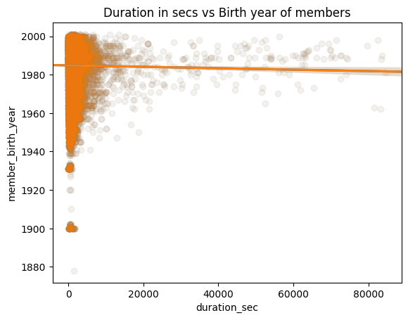
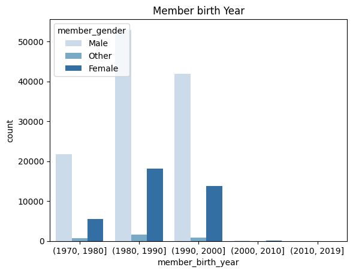
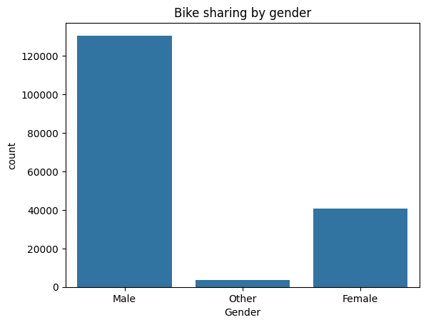

# communicating findings finals with Python
 Explore Ford GoBike Trip dataset to understand user demographics, gender preferences, and time-related patterns. Gain insights for optimizing the bike-sharing service and improving user experience.

**Part II - (Ford gobike trip)[**](#part-ii---\(ford-gobike-trip\))**

**by (NGWAM ALFRED NIYAH)[**](#by-\(ngwam-alfred-niyah\))**

**Investigation Overview[**](#investigation-overview)**

The overall aim of this presentation is to present key finding gotten during my exploratory analysis phase .During this phase it was seen that members burn between **1960 - 2000** takes less time to arrived their destination and that most genders heavily involve in this scheme were male genders.**Additionaly**,Findings reveals that there were more female count between **1980-1990**

**Dataset Overview and Executive Summary[**](#dataset-overview-and-executive-summary)**

The dataset Ford gobike trip is data that comes to replace the traditional bike renting scheme to a new generation of an automatic bike renting scheme. Through this system users are able to easily rent bike from a particular position and return it back to another position.Intrestingly, they exist a great interest in these system due to it important role in traffic, environmental and health issues.From the findings it could be seen that visuals display during study answers all problem questions . However, the following limitatations was encountered which will be important in future analysis.

In [2]:

*# import all packages and set plots to be embedded inline*

**import** numpy **as** np

**import** pandas **as** pd

**import** matplotlib.pyplot **as** plt

**import** seaborn **as** sns

*# suppress warnings from final output*

**import** warnings

warnings**.**simplefilter("ignore")

In [3]:

df **=** pd**.**read\_csv('201902-fordgobike-tripdata.csv')

df**.**head(60)

|Out[3]:||
| :- | :- |

||**duration\_sec**|**start\_time**|**end\_time**|**start\_station\_id**|**start\_station\_name**|**start\_station\_latitude**|**start\_station\_longitude**|**end\_station\_id**|**end\_station\_name**|**end\_station\_latitude**|**end\_station\_longitude**|**bike\_id**|**user\_type**|**member\_birth\_year**|**member\_gender**|**bike\_share\_for\_all\_trip**|
| -: | -: | -: | -: | -: | -: | -: | -: | -: | -: | -: | -: | -: | -: | -: | -: | -: |
|**0**|52185|2019-02-28 17:32:10.1450|2019-03-01 08:01:55.9750|21\.0|Montgomery St BART Station (Market St at 2nd St)|37\.789625|-122.400811|13\.0|Commercial St at Montgomery St|37\.794231|-122.402923|4902|Customer|1984\.0|Male|No|
|**1**|42521|2019-02-28 18:53:21.7890|2019-03-01 06:42:03.0560|23\.0|The Embarcadero at Steuart St|37\.791464|-122.391034|81\.0|Berry St at 4th St|37\.775880|-122.393170|2535|Customer|NaN|NaN|No|
|**2**|61854|2019-02-28 12:13:13.2180|2019-03-01 05:24:08.1460|86\.0|Market St at Dolores St|37\.769305|-122.426826|3\.0|Powell St BART Station (Market St at 4th St)|37\.786375|-122.404904|5905|Customer|1972\.0|Male|No|
|**3**|36490|2019-02-28 17:54:26.0100|2019-03-01 04:02:36.8420|375\.0|Grove St at Masonic Ave|37\.774836|-122.446546|70\.0|Central Ave at Fell St|37\.773311|-122.444293|6638|Subscriber|1989\.0|Other|No|
|**4**|1585|2019-02-28 23:54:18.5490|2019-03-01 00:20:44.0740|7\.0|Frank H Ogawa Plaza|37\.804562|-122.271738|222\.0|10th Ave at E 15th St|37\.792714|-122.248780|4898|Subscriber|1974\.0|Male|Yes|
|**5**|1793|2019-02-28 23:49:58.6320|2019-03-01 00:19:51.7600|93\.0|4th St at Mission Bay Blvd S|37\.770407|-122.391198|323\.0|Broadway at Kearny|37\.798014|-122.405950|5200|Subscriber|1959\.0|Male|No|
|**6**|1147|2019-02-28 23:55:35.1040|2019-03-01 00:14:42.5880|300\.0|Palm St at Willow St|37\.317298|-121.884995|312\.0|San Jose Diridon Station|37\.329732|-121.901782|3803|Subscriber|1983\.0|Female|No|
|**7**|1615|2019-02-28 23:41:06.7660|2019-03-01 00:08:02.7560|10\.0|Washington St at Kearny St|37\.795393|-122.404770|127\.0|Valencia St at 21st St|37\.756708|-122.421025|6329|Subscriber|1989\.0|Male|No|
|**8**|1570|2019-02-28 23:41:48.7900|2019-03-01 00:07:59.7150|10\.0|Washington St at Kearny St|37\.795393|-122.404770|127\.0|Valencia St at 21st St|37\.756708|-122.421025|6548|Subscriber|1988\.0|Other|No|
|**9**|1049|2019-02-28 23:49:47.6990|2019-03-01 00:07:17.0250|19\.0|Post St at Kearny St|37\.788975|-122.403452|121\.0|Mission Playground|37\.759210|-122.421339|6488|Subscriber|1992\.0|Male|No|
|**10**|458|2019-02-28 23:57:57.2110|2019-03-01 00:05:35.4350|370\.0|Jones St at Post St|37\.787327|-122.413278|43\.0|San Francisco Public Library (Grove St at Hyde...|37\.778768|-122.415929|5318|Subscriber|1996\.0|Female|Yes|
|**11**|506|2019-02-28 23:56:55.5400|2019-03-01 00:05:21.7330|44\.0|Civic Center/UN Plaza BART Station (Market St ...|37\.781074|-122.411738|343\.0|Bryant St at 2nd St|37\.783172|-122.393572|5848|Subscriber|1993\.0|Male|No|
|**12**|1176|2019-02-28 23:45:12.6510|2019-03-01 00:04:49.1840|127\.0|Valencia St at 21st St|37\.756708|-122.421025|323\.0|Broadway at Kearny|37\.798014|-122.405950|5328|Customer|1990\.0|Male|No|
|**13**|915|2019-02-28 23:49:06.0620|2019-03-01 00:04:21.8670|252\.0|Channing Way at Shattuck Ave|37\.865847|-122.267443|244\.0|Shattuck Ave at Hearst Ave|37\.873676|-122.268487|5101|Subscriber|NaN|NaN|No|
|**14**|395|2019-02-28 23:56:26.8480|2019-03-01 00:03:01.9470|243\.0|Bancroft Way at College Ave|37\.869360|-122.254337|252\.0|Channing Way at Shattuck Ave|37\.865847|-122.267443|4786|Subscriber|1988\.0|Male|No|
|**15**|208|2019-02-28 23:59:18.5480|2019-03-01 00:02:47.2280|349\.0|Howard St at Mary St|37\.781010|-122.405666|60\.0|8th St at Ringold St|37\.774520|-122.409449|6361|Subscriber|1993\.0|Male|Yes|
|**16**|548|2019-02-28 23:50:41.6070|2019-02-28 23:59:49.9530|131\.0|22nd St at Dolores St|37\.755000|-122.425728|71\.0|Broderick St at Oak St|37\.773063|-122.439078|6572|Subscriber|1981\.0|Male|No|
|**17**|674|2019-02-28 23:48:25.0950|2019-02-28 23:59:40.0920|74\.0|Laguna St at Hayes St|37\.776435|-122.426244|336\.0|Potrero Ave and Mariposa St|37\.763281|-122.407377|5343|Subscriber|1975\.0|Male|No|
|**18**|557|2019-02-28 23:49:01.8510|2019-02-28 23:58:19.8090|321\.0|5th St at Folsom|37\.780146|-122.403071|75\.0|Market St at Franklin St|37\.773793|-122.421239|5854|Subscriber|1990\.0|Male|No|
|**19**|874|2019-02-28 23:43:05.1830|2019-02-28 23:57:39.7960|180\.0|Telegraph Ave at 23rd St|37\.812678|-122.268773|180\.0|Telegraph Ave at 23rd St|37\.812678|-122.268773|5629|Customer|1978\.0|Male|No|
|**20**|417|2019-02-28 23:50:38.2390|2019-02-28 23:57:35.8520|72\.0|Page St at Scott St|37\.772406|-122.435650|107\.0|17th St at Dolores St|37\.763015|-122.426497|4999|Subscriber|1983\.0|Male|No|
|**21**|414|2019-02-28 23:50:26.8790|2019-02-28 23:57:21.1300|163\.0|Lake Merritt BART Station|37\.797320|-122.265320|221\.0|6th Ave at E 12th St (Temporary Location)|37\.794396|-122.253842|6007|Subscriber|1984\.0|Male|Yes|
|**22**|743|2019-02-28 23:44:56.4390|2019-02-28 23:57:20.2120|370\.0|Jones St at Post St|37\.787327|-122.413278|52\.0|McAllister St at Baker St|37\.777416|-122.441838|5479|Subscriber|1991\.0|Female|No|
|**23**|367|2019-02-28 23:51:06.0140|2019-02-28 23:57:13.3120|243\.0|Bancroft Way at College Ave|37\.869360|-122.254337|269\.0|Telegraph Ave at Carleton St|37\.862320|-122.258801|1804|Subscriber|1997\.0|Female|No|
|**24**|252|2019-02-28 23:52:51.1640|2019-02-28 23:57:03.9760|190\.0|West St at 40th St|37\.830223|-122.270950|189\.0|Genoa St at 55th St|37\.839649|-122.271756|5678|Subscriber|1975\.0|Male|No|
|**25**|360|2019-02-28 23:50:31.4310|2019-02-28 23:56:31.8910|163\.0|Lake Merritt BART Station|37\.797320|-122.265320|196\.0|Grand Ave at Perkins St|37\.808894|-122.256460|6240|Subscriber|1986\.0|Male|No|
|**26**|385|2019-02-28 23:49:24.3990|2019-02-28 23:55:50.2840|6\.0|The Embarcadero at Sansome St|37\.804770|-122.403234|15\.0|San Francisco Ferry Building (Harry Bridges Pl...|37\.795392|-122.394203|6531|Customer|2000\.0|Male|No|
|**27**|408|2019-02-28 23:48:08.2820|2019-02-28 23:54:56.9300|78\.0|Folsom St at 9th St|37\.773717|-122.411647|78\.0|Folsom St at 9th St|37\.773717|-122.411647|5410|Subscriber|1982\.0|Male|No|
|**28**|650|2019-02-28 23:43:27.5030|2019-02-28 23:54:18.4510|258\.0|University Ave at Oxford St|37\.872355|-122.266447|263\.0|Channing Way at San Pablo Ave|37\.862827|-122.290231|4784|Customer|NaN|NaN|No|
|**29**|629|2019-02-28 23:43:48.6580|2019-02-28 23:54:18.2540|258\.0|University Ave at Oxford St|37\.872355|-122.266447|263\.0|Channing Way at San Pablo Ave|37\.862827|-122.290231|363|Subscriber|1995\.0|Male|No|
|**30**|163|2019-02-28 23:50:45.6980|2019-02-28 23:53:29.5690|238\.0|MLK Jr Way at University Ave|37\.871719|-122.273068|244\.0|Shattuck Ave at Hearst Ave|37\.873676|-122.268487|5669|Subscriber|1996\.0|Male|Yes|
|**31**|223|2019-02-28 23:49:27.0270|2019-02-28 23:53:10.5350|28\.0|The Embarcadero at Bryant St|37\.787168|-122.388098|50\.0|2nd St at Townsend St|37\.780526|-122.390288|6267|Customer|1993\.0|Male|No|
|**32**|405|2019-02-28 23:45:39.2340|2019-02-28 23:52:24.8500|109\.0|17th St at Valencia St|37\.763316|-122.421904|73\.0|Pierce St at Haight St|37\.771793|-122.433708|5130|Subscriber|1980\.0|Female|No|
|**33**|638|2019-02-28 23:40:32.2730|2019-02-28 23:51:10.6390|98\.0|Valencia St at 16th St|37\.765052|-122.421866|373\.0|Potrero del Sol Park (25th St at Utah St)|37\.751792|-122.405216|6435|Subscriber|1973\.0|Male|No|
|**34**|471|2019-02-28 23:42:43.3610|2019-02-28 23:50:34.4460|133\.0|Valencia St at 22nd St|37\.755213|-122.420975|133\.0|Valencia St at 22nd St|37\.755213|-122.420975|5559|Subscriber|1992\.0|Male|No|
|**35**|318|2019-02-28 23:45:10.5550|2019-02-28 23:50:28.9050|113\.0|Franklin Square|37\.764555|-122.410345|115\.0|Jackson Playground|37\.765026|-122.398773|99|Subscriber|1985\.0|Female|No|
|**36**|148|2019-02-28 23:47:02.9530|2019-02-28 23:49:31.1410|220\.0|San Pablo Ave at MLK Jr Way|37\.811351|-122.273422|180\.0|Telegraph Ave at 23rd St|37\.812678|-122.268773|4864|Subscriber|1983\.0|Male|No|
|**37**|305|2019-02-28 23:44:12.6760|2019-02-28 23:49:17.7000|122\.0|19th St at Mission St|37\.760299|-122.418892|96\.0|Dolores St at 15th St|37\.766210|-122.426614|6264|Subscriber|1984\.0|Female|No|
|**38**|1066|2019-02-28 23:31:16.1390|2019-02-28 23:49:02.7920|58\.0|Market St at 10th St|37\.776619|-122.417385|145\.0|29th St at Church St|37\.743684|-122.426806|5938|Subscriber|1992\.0|Female|No|
|**39**|737|2019-02-28 23:35:45.4420|2019-02-28 23:48:03.1570|87\.0|Folsom St at 13th St|37\.769757|-122.415674|122\.0|19th St at Mission St|37\.760299|-122.418892|6456|Customer|1992\.0|Female|No|
|**40**|328|2019-02-28 23:42:13.9100|2019-02-28 23:47:42.5430|7\.0|Frank H Ogawa Plaza|37\.804562|-122.271738|195\.0|Bay Pl at Vernon St|37\.812314|-122.260779|5154|Subscriber|1971\.0|Male|No|
|**41**|346|2019-02-28 23:40:56.0750|2019-02-28 23:46:42.4830|10\.0|Washington St at Kearny St|37\.795393|-122.404770|19\.0|Post St at Kearny St|37\.788975|-122.403452|6488|Subscriber|1992\.0|Male|No|
|**42**|1554|2019-02-28 23:20:24.0890|2019-02-28 23:46:19.0190|15\.0|San Francisco Ferry Building (Harry Bridges Pl...|37\.795392|-122.394203|284\.0|Yerba Buena Center for the Arts (Howard St at ...|37\.784872|-122.400876|5411|Subscriber|1972\.0|Male|No|
|**43**|116|2019-02-28 23:44:00.9880|2019-02-28 23:45:57.4820|104\.0|4th St at 16th St|37\.767045|-122.390833|93\.0|4th St at Mission Bay Blvd S|37\.770407|-122.391198|823|Subscriber|1959\.0|Male|No|
|**44**|747|2019-02-28 23:32:59.4640|2019-02-28 23:45:26.9530|27\.0|Beale St at Harrison St|37\.788059|-122.391865|34\.0|Father Alfred E Boeddeker Park|37\.783988|-122.412408|6521|Subscriber|1995\.0|Male|No|
|**45**|717|2019-02-28 23:33:21.0950|2019-02-28 23:45:18.5100|9\.0|Broadway at Battery St|37\.798572|-122.400869|58\.0|Market St at 10th St|37\.776619|-122.417385|6581|Subscriber|1980\.0|Male|No|
|**46**|157|2019-02-28 23:41:35.8980|2019-02-28 23:44:12.9500|140\.0|Cesar Chavez St at Dolores St|37\.747858|-122.424986|132\.0|24th St at Chattanooga St|37\.751819|-122.426614|4571|Subscriber|1981\.0|Male|No|
|**47**|417|2019-02-28 23:36:35.5790|2019-02-28 23:43:33.0270|310\.0|San Fernando St at 4th St|37\.335885|-121.885660|294\.0|Pierce Ave at Market St|37\.327581|-121.884559|1501|Subscriber|1993\.0|Male|Yes|
|**48**|287|2019-02-28 23:38:32.5140|2019-02-28 23:43:20.4670|53\.0|Grove St at Divisadero|37\.775946|-122.437777|377\.0|Fell St at Stanyan St|37\.771917|-122.453704|4958|Subscriber|1989\.0|Male|No|
|**49**|203|2019-02-28 23:37:29.8330|2019-02-28 23:40:52.8700|106\.0|Sanchez St at 17th St|37\.763242|-122.430675|109\.0|17th St at Valencia St|37\.763316|-122.421904|6355|Subscriber|1979\.0|Male|No|
|**50**|1441|2019-02-28 23:15:30.5090|2019-02-28 23:39:32.5030|340\.0|Harmon St at Adeline St|37\.849735|-122.270582|216\.0|San Pablo Ave at 27th St|37\.817827|-122.275698|3159|Subscriber|1974\.0|Female|Yes|
|**51**|532|2019-02-28 23:30:37.9410|2019-02-28 23:39:30.2060|28\.0|The Embarcadero at Bryant St|37\.787168|-122.388098|349\.0|Howard St at Mary St|37\.781010|-122.405666|6361|Customer|1984\.0|Male|No|
|**52**|717|2019-02-28 23:27:21.1620|2019-02-28 23:39:18.9160|121\.0|Mission Playground|37\.759210|-122.421339|70\.0|Central Ave at Fell St|37\.773311|-122.444293|4449|Subscriber|1992\.0|Male|No|
|**53**|3418|2019-02-28 22:41:16.3620|2019-02-28 23:38:14.3630|11\.0|Davis St at Jackson St|37\.797280|-122.398436|11\.0|Davis St at Jackson St|37\.797280|-122.398436|319|Customer|NaN|NaN|No|
|**54**|401|2019-02-28 23:30:52.4710|2019-02-28 23:37:33.9550|58\.0|Market St at 10th St|37\.776619|-122.417385|62\.0|Victoria Manalo Draves Park|37\.777791|-122.406432|5407|Subscriber|1990\.0|Female|No|
|**55**|3478|2019-02-28 22:39:35.0200|2019-02-28 23:37:33.3420|11\.0|Davis St at Jackson St|37\.797280|-122.398436|11\.0|Davis St at Jackson St|37\.797280|-122.398436|1846|Subscriber|1995\.0|Male|No|
|**56**|3140|2019-02-28 22:44:53.5030|2019-02-28 23:37:14.0900|11\.0|Davis St at Jackson St|37\.797280|-122.398436|11\.0|Davis St at Jackson St|37\.797280|-122.398436|3040|Subscriber|1983\.0|Female|No|
|**57**|324|2019-02-28 23:31:35.7860|2019-02-28 23:36:59.9310|121\.0|Mission Playground|37\.759210|-122.421339|138\.0|Jersey St at Church St|37\.750900|-122.427411|6592|Subscriber|1988\.0|Male|No|
|**58**|120|2019-02-28 23:34:58.9860|2019-02-28 23:36:59.3780|140\.0|Cesar Chavez St at Dolores St|37\.747858|-122.424986|138\.0|Jersey St at Church St|37\.750900|-122.427411|5518|Subscriber|1981\.0|Male|No|
|**59**|422|2019-02-28 23:28:50.4640|2019-02-28 23:35:52.5520|240\.0|Haste St at Telegraph Ave|37\.866043|-122.258804|240\.0|Haste St at Telegraph Ave|37\.866043|-122.258804|5649|Subscriber|1997\.0|Male|Yes|

|||
| :- | :- |
In [4]:

*# plot of a scatter plot* 

numerical\_data **=** ['member\_birth\_year','duration\_sec']

**for** i **in** enumerate(numerical\_data):

`    `sns**.**regplot(data**=**df, x**=**'duration\_sec', y**=**'member\_birth\_year', truncate**=False**, x\_jitter**=**0.3, scatter\_kws**=**{'alpha':1**/**20});

`    `plt**.**xlabel('duration\_sec')

`    `plt**.**ylabel('member\_birth\_year')

`    `plt**.**title('Duration in secs vs Birth year of members')

|||
| :- | :- |

It is clear that those who took lesser time in riding were those burn between 1960-2000

**(Visualization 2)[**](#\(visualization-2\))**

You should have at least three visualizations in your presentation, but feel free to add more if you'd like!

In [8]:

*# plotting of a clustered bar chart*

bins **=**  [1970,1980,1990,2000,2010,2019]

df['member\_birth\_year'] **=** pd**.**cut(df['member\_birth\_year'],bins)

sns**.**countplot(data **=** df, x**=** "member\_birth\_year",hue **=** 'member\_gender',palette **=** 'Blues');

plt**.**title('Member birth Year')

|Out[8]:|Text(0.5, 1.0, 'Member birth Year')|
| :- | :- |

|||
| :- | -: |

It is clear that there more count of male between **1980 -1990**

**(Visualization 3)[**](#\(visualization-3\))**

You should have at least three visualizations in your presentation, but feel free to add more if you'd like!

In [7]:

*# Univariate plot of member gender*

base\_color **=** sns**.**color\_palette()[0]

sns**.**countplot(data **=** df ,x **=** 'member\_gender', color **=** base\_color)

plt**.**xticks();

plt**.**xlabel('Gender')

plt**.**ylabel('count')

plt**.**title('Bike sharing by gender')

|Out[7]:|Text(0.5, 1.0, 'Bike sharing by gender')|
| :- | :- |

|||
| :- | -: |

This visualization shows that there were more count in male during the survey than the other category

**Conclusion[**](#conclusion)**

All the variabel considered during the questions phase of this analysis has showned evident to be worth considering and efficient improvement in the authormatic bike renting systems.However, a limitation factor was encountered during this analysis.**For example**, missing values which could look
 
